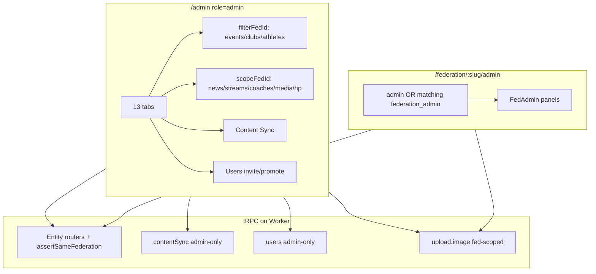

# Gap Analysis — Admin CMS + FedAdmin

**Wave:** `gap_wave_20260725` · **Doc:** `05_admin_cms.md`  
**Date:** 2026-07-25  
**Workspace:** `C:\Projects\The Dome\namibia-sports-platform`  
**Scope:** Platform `/admin` tabs vs tRPC routers; Content Sync; Users invite; ImageUpload coverage; FedAdmin parity; missing CRUD; federation filters.  
**Method:** Static code audit (client Admin/FedAdmin surfaces ↔ `server/routers/*` ↔ schema). No DB mutations.

**Rules applied:** SEARCH FIRST / NO ASSUMPTIONS / documentation deliverable.

---

## 1. Executive verdict

| Metric | Verdict |
|--------|---------|
| **Overall Admin CMS readiness** | **Strong beta** — real tRPC CRUD, not mock |
| **Platform `/admin` vs routers** | **~85% surface coverage** — entity CMS largely complete; ops routers (WhatsApp, AI chat, Search) have **no** admin UI |
| **FedAdmin parity** | **Good for tenant entities**; intentionally excluded from venues/schools/users/contentSync/federations |
| **Federation filters** | **Working** where wired; **split state** + missing on venues/schools/media “all” list |
| **Biggest residual gaps** | Invite is create/promote **not** email-invite; Media has **no update**; list **cap 200**; dual filter state; venue upload fed hack |

**One-liner:** Ship soft-beta Admin + FedAdmin for directory CRUD; close invite UX honesty, unify federation filter state, and treat WhatsApp/AI as out-of-CMS until productized.

---

## 2. Platform Admin tabs ↔ routers matrix

**Source of truth (UI):** `client/src/pages/Admin.tsx` — `TABS` (13 tabs).  
**Source of truth (API):** `server/routers/index.ts` — `appRouter`.

| `/admin` tab | UI implementation | Primary router(s) | List / Read | Create | Update | Delete | Extra procedures used in UI | Gap |
|--------------|-------------------|-------------------|-------------|--------|--------|--------|-----------------------------|-----|
| Federations | `FederationsTable` + `FederationForm` | `federations` | `listAll` | `create` | `update` | `delete` | — | Low — create has no logo upload until after save |
| Events | `EventsTable` + `EventForm` | `events` | `list` (+ unpublished) | `create` | `update` | `delete` | — | Medium — native table UI, not shared FedAdmin panel |
| Clubs | `ClubsTable` + `ClubForm` | `clubs` | `list` (+ inactive) | `create` | `update` | `delete` | — | Same as Events |
| Athletes | `AthletesTable` + `AthleteForm` | `athletes` | `list` (+ inactive, PII) | `create` | `update` | `delete` | — | Same as Events |
| Coaches | embeds `FedAdminCoaches` | `coaches` | `list` | `create` | `update` | `delete` | — | OK |
| News | embeds `FedAdminNews` | `news` | `list` (+ unpublished) | `create` | `update` | `delete` | `publish` | OK — drafts via form; publish is list action |
| Streams | embeds `FedAdminStreams` | `streams` | `list` | `create` | `update` | `delete` | `setLive` | OK |
| Venues | `AdminVenuesPanel` | `venues` | `list` (+ inactive) | `create` | `update` | `delete` | `upload.image` | Medium — no fed filter; upload scoped to first federation id |
| Schools | `AdminSchoolsPanel` | `schools` | `list` | `create` | `update` | `delete` | — | Low — no image column (by design) |
| Media | `MediaLibrary` via `AdminFedScope` | `media`, `upload` | `list` | `create` | **—** | `delete` | — | **High** — no `media.update`; create only `entityType=federation` |
| HP Programs | embeds `FedAdminHpPrograms` | `hpPrograms` | `list` | `create` | `update` | `delete` | — | Low — no image fields in schema |
| Content Sync | `AdminContentSyncPanel` | `contentSync` | `status` | drafts via create* | — | — | `suggestNews/Events`, `createNewsDraft/EventDraft` | Medium — depends on AI provider / flag |
| Users | `UsersAdminPanel` | `users` | `list` | `inviteOrPromote` | `setRole` | **—** | `inviteCapabilities` | Medium — no delete/disable; invite ≠ email invite |

### Routers with **no** `/admin` tab

| Router | Procedures (summary) | Admin CMS gap |
|--------|----------------------|---------------|
| `auth` | `me`, login/logout | N/A (used for gate) |
| `adminStats` | `counts` | Used by `AdminStatsCards` (not a tab) — OK |
| `upload` | `image` | Used via `ImageUpload` — OK |
| `search` | `global` | No admin search/debug UI |
| `whatsapp` | subscribe / unsubscribe / getSubscriptions | **No** subscriber admin panel (feature hard-disabled ops-wise) |
| `ai` | generateSummary / suggestTags / chatAssistant | **No** admin console (public chat gated separately) |
| `system` | health | No admin status tab |

### Auth gate (Platform Admin)

- `/admin` requires `auth.me` → `role === "admin"`; others redirected (`Admin.tsx`).
- Federation admins **cannot** open Platform Admin (by design). They use `/federation/:slug/admin`.

---

## 3. Content Sync

**UI:** `client/src/pages/admin/AdminContentSyncPanel.tsx`  
**API:** `server/routers/contentSync.ts`  
**Docs:** `docs/research/CONTENT_SYNC_AI.md`

| Procedure | Auth | UI wired | Notes |
|-----------|------|----------|-------|
| `status` | `adminProcedure` | Yes | Shows provider + Ready/Unavailable |
| `suggestNews` | admin | Yes | Optional `federationId` |
| `suggestEvents` | admin | Yes | Optional `federationId` |
| `createNewsDraft` | admin | Yes | Always `isPublished: false` |
| `createEventDraft` | admin | Yes | Placeholder start date when AI date missing |

### Working

- Tab present in Platform Admin; federation scope via `AdminFederationFilter`.
- Drafts only; human publish remains News/Events CMS.
- Rate limits + `ENABLE_CONTENT_SYNC` kill-switch.
- Clear fallback copy when AI unavailable.

### Gaps

| Gap | Severity | Detail |
|-----|----------|--------|
| AI provider may be unset | High (ops) | Without Workers AI binding **and** `ANTHROPIC_API_KEY`, panel is “Unavailable” — CMS still works manually |
| No FedAdmin access | Low (intentional) | Platform-admin only |
| No auto-link to edit draft | Low | Success message points to News/Events tabs; no deep-link to draft id |
| Separate from RSS aggregator | Info | Edge `news-aggregator` is a different pipeline — not in this UI |
| Event drafts may need date fix | Medium | UI warns when `startDatePlaceholder` |

**Verdict:** Feature-complete MVP for Platform Admin when AI is configured; not a FedAdmin capability.

---

## 4. Users invite

**UI:** `UsersAdminPanel` + `AddUserForm`  
**API:** `server/routers/users.ts`

| Capability | Status | Evidence |
|------------|--------|----------|
| List users | Done | `users.list` |
| Assign role (`user` / `admin` / `federation_admin`) | Done | `users.setRole` + federation required for fed admin |
| Add / promote by email | Done | `users.inviteOrPromote` |
| Capability probe | Done | `users.inviteCapabilities` → `canCreateAuthUser` |
| True email invite (`inviteUserByEmail`) | **Missing** | Uses `auth.admin.createUser` + `email_confirm: true` — **no** invite/magic-link send in repo |
| Password / recovery UX | Partial | Copy says recovery/sign-in; no admin-triggered recovery email |
| Disable / delete user | **Missing** | No procedure + no UI |
| `club_manager` assign | Deferred | Zod rejects `clubId`; enum exists only |
| FedAdmin invite own editors | **Missing** | Platform admin only |
| `users.findByEmail` | Dead API surface | Procedure exists; UI does not call it |

### Invite flow reality

1. If `SUPABASE_SERVICE_ROLE_KEY` set → create Auth user (confirmed) + platform row + role.  
2. Else → `PRECONDITION_FAILED`: user must `/register` first, then promote.  
3. Existing Auth-without-platform edge case returns `CONFLICT` (sign in once, then promote).

**Gap severity:** Medium — product copy says “invite” but behavior is **provision/promote**, not invitation email.

---

## 5. ImageUpload coverage

**Component:** `client/src/components/admin/ImageUpload.tsx`  
**API:** `upload.image` (`federationAdminProcedure` + `assertSameFederation`)  
**Entities allowed by upload router:** `federation | club | event | athlete | coach | news | venue | stream`

| Form / surface | ImageUpload? | Field(s) | Notes |
|----------------|--------------|----------|-------|
| `FederationForm` | Yes (edit only) | `logo`, `backgroundImage` | Create: “Save first to upload” |
| `ClubForm` | Yes | `logoUrl` | |
| `EventForm` | Yes | `posterUrl` | |
| `AthleteForm` | Yes | `photoUrl` | |
| `CoachForm` | Yes | `photoUrl` | |
| `NewsForm` | Yes | `featuredImage` | entityId `0` until saved |
| `StreamForm` | Yes | `thumbnailUrl` | |
| `VenueForm` | Yes | `photoUrl` | Requires `uploadFederationId` (tenant token for storage path) |
| `MediaLibrary` | Yes | upload then `media.create` | Always attaches as `entityType: "federation"` |
| `SchoolForm` | **No** | — | Schema has **no** photo column |
| `HpProgramForm` | **No** | — | Schema has **no** photo column |
| `AddUserForm` | **No** | — | N/A |

### ImageUpload gaps

| Gap | Severity | Detail |
|-----|----------|--------|
| Schools / HP no images | Low | Schema-limited; not a UI bug |
| Media UI cannot target club/event/athlete/venue/coach | Medium | Router `media.create` supports those `entityType`s; UI hardcodes federation |
| Venue upload federation | Medium | `AdminVenuesPanel` passes `fedsQuery.data?.[0]?.id ?? 1` — arbitrary tenant for platform-scoped venues |
| Create-then-upload friction | Low | Consistent pattern (`entityId === 0` message) |
| No upload for `school` / `hp` in `upload` entity enum | Info | Matches schema |

---

## 6. FedAdmin parity

**Routes:** `/federation/:slug/admin` (+ `/:section`) via `FederationLayout.tsx`  
**Nav:** `FedAdminLayout.tsx` — Dashboard, Events, Clubs, Athletes, Coaches, News, Streams, Media, HP Programs  
**Access:** `admin` **or** `federation_admin` with matching `federationId`

### Parity matrix (Platform Admin vs FedAdmin vs Router)

| Entity | Platform `/admin` | FedAdmin | Router write auth | Parity notes |
|--------|-------------------|----------|-------------------|--------------|
| Federations | Yes | No | `adminProcedure` | Correct — fed admins must not CRUD directory |
| Events | Yes (native tables) | Yes | `federationAdminProcedure` | Dual UI implementations |
| Clubs | Yes (native) | Yes | fedAdmin | Dual UI |
| Athletes | Yes (native) | Yes | fedAdmin | Dual UI |
| Coaches | Yes (shared component) | Yes | fedAdmin | Shared — good |
| News | Yes (shared) | Yes | fedAdmin + `publish` | Shared — good |
| Streams | Yes (shared) | Yes | fedAdmin + `setLive` | Shared — good |
| Media | Yes (shared `MediaLibrary`) | Yes | fedAdmin | Shared; create federation-scoped only |
| HP Programs | Yes (shared) | Yes | fedAdmin | Shared |
| Venues | Yes | **No** | `adminProcedure` | Intentional platform scope |
| Schools | Yes | **No** | `adminProcedure` | Intentional |
| Users / roles | Yes | **No** | `adminProcedure` | FedAdmin cannot invite editors |
| Content Sync | Yes | **No** | `adminProcedure` | Intentional |
| Dashboard stats | `adminStats.counts` + fed breakdown | List-length cards | — | FedAdmin stats **capped by list limit** (200); omit coaches/media/HP |

### FedAdmin-specific gaps

| Gap | Severity | Detail |
|-----|----------|--------|
| No venues/schools management | Low–Med | By design today; federations that “own” venues have no tenant UI |
| No user management | Medium | Platform admin must provision every federation editor |
| No Content Sync | Low | Intentional |
| Dashboard incomplete | Low | Missing coaches / media / HP counts; counts = `array.length` not SQL `count` |
| Events/Clubs/Athletes not reused on Platform Admin | Low | Maintenance drift risk (two list UIs) |
| Unknown admin section | Low | Invalid `:section` renders empty main (no 404) |

---

## 7. Missing / incomplete CRUD

### API present, UI thin or absent

| Area | API | UI gap |
|------|-----|--------|
| `media.update` | **Does not exist** | Create + delete only; no title/caption edit |
| Media polymorphic create | `entityType` enum includes club/event/athlete/venue/coach | UI only creates federation media |
| `users` delete / suspend | Absent | Cannot offboard |
| WhatsApp subscriptions admin | `whatsapp.*` | No CMS |
| AI admin tooling | `ai.*` | No CMS |
| `users.findByEmail` | Exists | Unused by UI |
| News `sourceUrl` / `sourceName` | In schema + Content Sync notes | NewsForm does not edit attribution fields |

### Soft limits that look like missing data

| Limit | Where | Impact |
|-------|-------|--------|
| `ADMIN_LIMIT = 200` | Platform Admin events/clubs/athletes queries | Large federations truncated in tables |
| `media.list` limit 100 | `media.ts` | Unscoped admin dump incomplete |
| FedAdmin dashboard | Uses list lengths | Under-count past limit |
| Client-side search only | Most admin lists | Search only within fetched page |

### Intentional non-CRUD

| Item | Reason |
|------|--------|
| `club_manager` role | Deferred until club-scoped write procedures |
| Schools/HP images | No columns |
| Federations delete in FedAdmin | Platform-only |

---

## 8. Federation filters — what actually works

### Two independent filter states in Platform Admin

| State | Tabs | Behavior |
|-------|------|----------|
| `filterFedId` | **events, clubs, athletes** | Passed into `list` as `federationId`; also `federationIdLock` on create forms |
| `scopeFedId` | **news, streams, coaches, media, hp** | Via `AdminFedScope` → child `federationId?: number` |

**Gap (Medium):** Selecting a federation on Events does **not** carry over when switching to News (and vice versa). Operators must re-pick.

### Per-tab filter status

| Tab | Filter UI | Server-side filter | Create lock / seed | Working? |
|-----|-----------|--------------------|--------------------|----------|
| Federations | No | N/A | N/A | N/A |
| Events | `AdminFederationFilter` | Yes (`events.list`) | Yes (`federationIdLock`) | **Yes** |
| Clubs | same | Yes | Yes | **Yes** |
| Athletes | same | Yes | Yes | **Yes** |
| Coaches | `AdminFedScope` | Yes when id set; all when null | CreateFedPicker when null | **Yes** |
| News | `AdminFedScope` | Yes / all | CreateFedPicker when null | **Yes** |
| Streams | `AdminFedScope` | Yes / all | CreateFedPicker when null | **Yes** |
| Media | `AdminFedScope` | Scoped query when set; **unscoped dump** when null (admin only, cap 100) | CreateFedPicker when null | **Yes** (with dump limit) |
| HP | `AdminFedScope` | Yes / all | CreateFedPicker when null | **Yes** |
| Venues | **None** | Venues have **no** `federationId` column | Upload uses first federation id | Filter N/A; upload scope hack |
| Schools | **None** | Schools not federation-scoped | N/A | N/A |
| Content Sync | Own filter | Suggest scoped; draft requires fed id | Draft needs fed | **Yes** |
| Users | None (role/fed on assign) | N/A | Fed required for `federation_admin` | OK |

### FedAdmin filters

- Always locked to route federation (`federation.id` from slug).
- Cross-tenant create impossible from UI (forms use `federationIdLock` / fixed prop).
- Platform `admin` may open any federation’s FedAdmin URL — intended superuser escape hatch.

---

## 9. Architecture sketch (current)

---

## 10. Prioritized backlog (Admin CMS + FedAdmin only)

### P0 — correctness / honesty

1. **Invite copy + behavior** — either wire `inviteUserByEmail` / recovery link, or rename UI to “Add / promote user” and document password path.  
2. **Venue `uploadFederationId`** — stop using `federations[0] ?? 1`; use a dedicated platform upload tenant or admin-bypass path that does not pretend a random federation owns the file.  
3. **Unify `filterFedId` / `scopeFedId`** into one Platform Admin federation scope (persist across tabs).

### P1 — completeness

4. Add `media.update` (title / thumbnail) + UI edit.  
5. Media create: allow entity type + entity id picker (club/event/athlete/…), not federation-only.  
6. Raise or paginate admin lists (replace hard `200` / media `100`).  
7. FedAdmin: invite/promote **federation_admin** for *own* federation only (narrow procedure) — or document that Platform Admin is the only path.  
8. NewsForm: `sourceUrl` / `sourceName` fields for attribution.

### P2 — polish / parity

9. Reuse FedAdmin Events/Clubs/Athletes panels inside Platform Admin (drop duplicate `AdminTables` CRUD) **or** extract shared table kit.  
10. FedAdmin dashboard: SQL counts + coaches/media/HP cards.  
11. Users: deactivate / soft-delete; surface `findByEmail` in Add User.  
12. Optional WhatsApp subscriber read-only admin when feature re-enabled.  
13. Invalid FedAdmin `:section` → redirect to dashboard.

---

## 11. Scorecard (this wave)

| Area | Score / 10 | Notes |
|------|------------|-------|
| Tab completeness vs entity routers | 9 | All core entity routers have CMS tabs |
| Ops routers in CMS | 2 | WhatsApp / AI / Search absent (mostly intentional) |
| Content Sync | 8 | MVP complete; provider-dependent |
| Users invite | 6 | Promote works; true invite + offboarding missing |
| ImageUpload coverage | 8 | All image-bearing forms covered; venues/media edge cases |
| FedAdmin parity | 8 | Strong for tenant CRUD; no users/venues/schools |
| Federation filters | 7 | Working but dual state + media dump limit |
| Missing CRUD | 7 | Media update + list caps are the main holes |

**Weighted Admin CMS health ≈ 7.5 / 10** for soft beta.

---

## 12. File index (audit evidence)

| Path | Role |
|------|------|
| `client/src/pages/Admin.tsx` | Platform tabs, filters, CRUD wiring |
| `client/src/pages/admin/*` | Filter, scope, venues/schools/content sync/stats/tables |
| `client/src/pages/federation/admin/*` | FedAdmin panels + layout |
| `client/src/pages/federation/FederationLayout.tsx` | FedAdmin auth gate + section routing |
| `client/src/components/admin/*` | Forms, ImageUpload, Users, MediaLibrary |
| `server/routers/index.ts` | Router registry |
| `server/routers/{federations,clubs,events,athletes,coaches,news,streams,venues,schools,media,hpPrograms,users,contentSync,upload,adminStats}.ts` | CRUD surfaces |
| `docs/research/CONTENT_SYNC_AI.md` | Content Sync product contract |
| `docs/04_features_audit.md` | Prior feature matrix (still broadly accurate) |

---

## 13. DB mutations this analysis

**None.**
